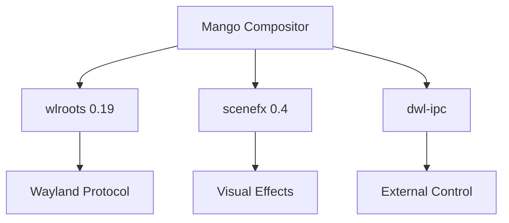

## What is Mango?

Mango is a dynamic Wayland compositor based on [dwl](https://codeberg.org/dwl/dwl/), designed to be **lightweight**, **fast**, and **feature-complete**. It builds in seconds while providing advanced window management capabilities, smooth animations, and modern visual effects.

<CardGroup cols={2}>
  <Card title="Lightweight" icon="feather">
    Builds completely in seconds, as fast as dwl itself
  </Card>
  <Card title="Feature-Rich" icon="sparkles">
    Advanced animations, effects, and window management without compromise
  </Card>
  <Card title="Stable" icon="shield-check">
    Production-ready with months of testing and development
  </Card>
  <Card title="Practical" icon="tools">
    Features designed for real daily workflows
  </Card>
</CardGroup>

## Philosophy

Mango follows three core principles:

<Note>
**Stability First**: After extensive testing, Mango prioritizes stability with minimal breaking changes.
</Note>

<Note>
**Practicality Over Features**: Only features that genuinely improve daily workflows are added.
</Note>

<Note>
**Community-Driven**: Niche features are considered based on community demand and upvotes.
</Note>

## Key Features

### Window Management

- **Tags, not workspaces** - Separate window layouts for each tag
- **Flexible layouts** with easy switching:
  - `tile`, `scroller`, `master-stack`, `monocle`
  - `center_tile`, `grid`, `deck`, `vertical_tile`
  - `vertical_grid`, `vertical_scroller`, `tgmix`
- **Rich window states**: swallow, minimize, maximize, unglobal, global, fakefullscreen, overlay
- **Sway-like scratchpad** with named scratchpad support
- **Hycov-like overview** for quick window navigation

### Animations & Effects

<CardGroup cols={2}>
  <Card title="Smooth Animations" icon="wand-magic-sparkles">
    Customizable animations for window open/close/move, tag switching, and layer transitions
  </Card>
  <Card title="Visual Effects" icon="palette">
    Blur, shadows, corner radius, and opacity powered by scenefx
  </Card>
</CardGroup>

### Input & Integration

- **Excellent XWayland support** for compatibility with X11 applications
- **Advanced input method support** (text-input-v2/v3)
- **IPC support** - Control compositor from external programs
- **Hot-reload configuration** - Update shortcuts without restarting

### Performance

<Warning>
**Zero Flickering** - Every frame is perfect. Mango ensures smooth, flicker-free rendering.
</Warning>

## Comparison to Similar Compositors

| Feature | Mango | dwl | Hyprland | Sway |
|---------|-------|-----|----------|------|
| Build Time | Seconds | Seconds | Minutes | Minutes |
| Animations | ✓ | ✗ | ✓ | ✗ |
| Visual Effects | ✓ | ✗ | ✓ | Limited |
| Tags vs Workspaces | Tags | Tags | Workspaces | Workspaces |
| Configuration | External file | Recompile | Config file | Config file |
| Hot-reload | ✓ | ✗ | ✓ | Partial |
| Memory Usage | Very Low | Very Low | Medium | Low |
| Based On | dwl/wlroots | wlroots | wlroots | wlroots |

### Why Choose Mango?

<Steps>
  <Step title="Coming from dwl">
    Get all the features you wanted (animations, effects, better config) while keeping the lightweight footprint
  </Step>
  
  <Step title="Coming from Hyprland">
    Similar feature set with faster builds, lower resource usage, and tag-based workflow
  </Step>
  
  <Step title="Coming from Sway">
    More dynamic layouts, smooth animations, and visual effects with a familiar scratchpad system
  </Step>
</Steps>

## Architecture

Mango is built on proven technologies:

- **wlroots 0.19+** - Robust Wayland compositor library
- **scenefx 0.4+** - Efficient visual effects without performance penalty
- **dwl heritage** - Proven window management logic
- **Custom IPC** - Scriptable and extensible

## Version

Mango is currently at version **0.12.5** with active development and community support.

<Card title="Join the Community" icon="discord" href="https://discord.gg/CPjbDxesh5">
  Get help, share configurations, and discuss features on our Discord server
</Card>

## What's Next?

<CardGroup cols={2}>
  <Card title="Quick Start" icon="rocket" href="/quickstart">
    Get Mango up and running in minutes
  </Card>
  <Card title="Configuration" icon="gear" href="/configuration/overview">
    Learn how to customize Mango to your needs
  </Card>
</CardGroup>